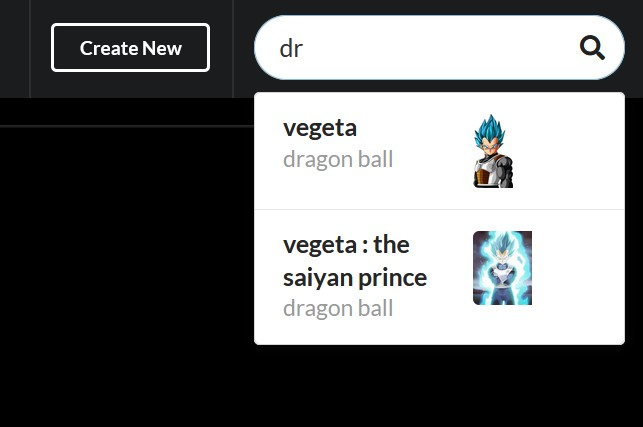
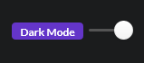
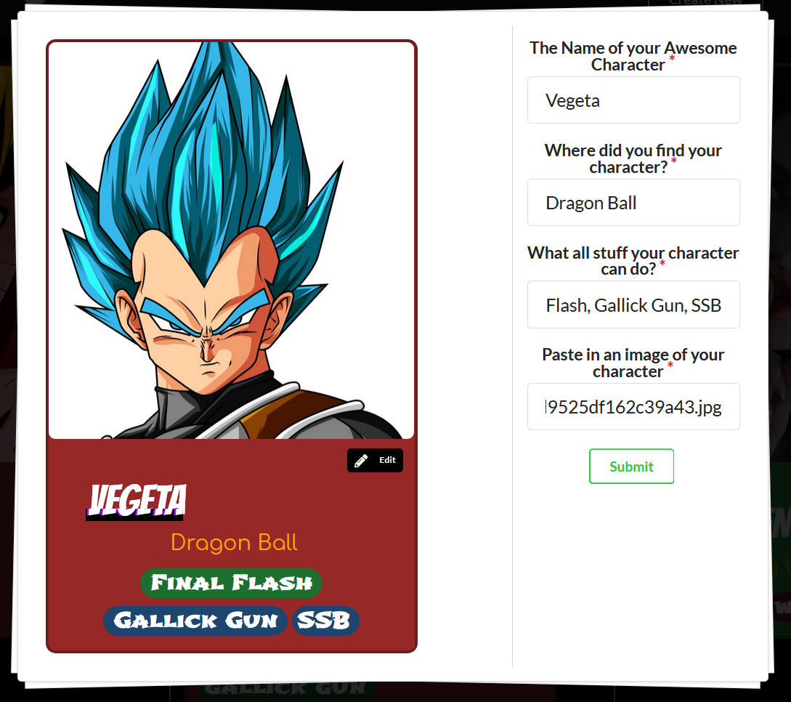
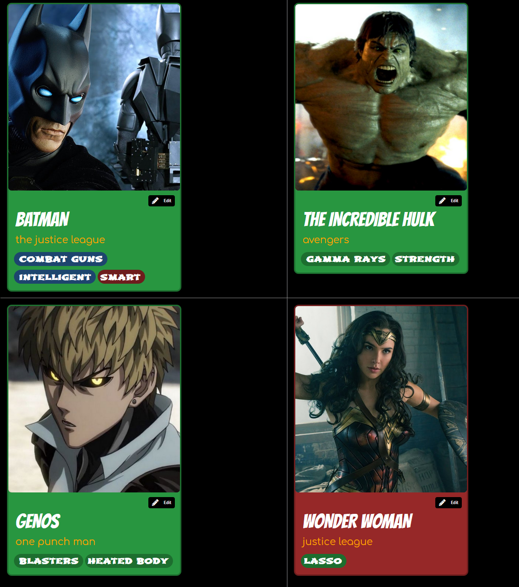

<h1 align="center">
  
  <br>
  Card Builder
</h1>

## Description 

_**Character Card Builder**_ is an app which can create awesome cards like this.

<p></p>

#### Why did you make this app? 

To implement what I learnt. I created _CCB_ in **1 week** after I finished learning [PostgreSQL](https://mode.com/sql-tutorial/).  During the process I also learnt [ReduxJS](https://redux.js.org/).

## Features 

#### 1. Integrated Search

<p></p>

#### 2. Dark Mode 

<p></p>

#### 3. Create New Cards _(no signup required)_

<p></p>

#### 4. Showcase Your Cards

<p></p>


## [Backend](https://cardbuilderv2.herokuapp.com/) 

The Backend uses **PostgreSQL** *(no ORM - raw SQL queries)* as the *Database* and **NodeJS** as *runtime* with **Express** framework.

**Code for backend can be found [here on the *backend* branch](https://github.com/uinstinct/card_builder/tree/backend)**

## [Frontend](https://charactercardbuilder.netlify.app/) 

The frontend is made using **React and Redux**, **Semantic UI** and **Axios** for api calls.

**Code for frontend can be found [here on the _fronted_ branch](https://github.com/uinstinct/card_builder/tree/frontend)**

## License  

Closures is provided under the [MIT License](./LICENSE).

```
MIT License

Copyright (c) 2021 Aditya Mitra

Permission is hereby granted, free of charge, to any person obtaining a copy
of this software and associated documentation files (the "Software"), to deal
in the Software without restriction, including without limitation the rights
to use, copy, modify, merge, publish, distribute, sublicense, and/or sell
copies of the Software, and to permit persons to whom the Software is
furnished to do so, subject to the following conditions:

The above copyright notice and this permission notice shall be included in all
copies or substantial portions of the Software.

THE SOFTWARE IS PROVIDED "AS IS", WITHOUT WARRANTY OF ANY KIND, EXPRESS OR
IMPLIED, INCLUDING BUT NOT LIMITED TO THE WARRANTIES OF MERCHANTABILITY,
FITNESS FOR A PARTICULAR PURPOSE AND NONINFRINGEMENT. IN NO EVENT SHALL THE
AUTHORS OR COPYRIGHT HOLDERS BE LIABLE FOR ANY CLAIM, DAMAGES OR OTHER
LIABILITY, WHETHER IN AN ACTION OF CONTRACT, TORT OR OTHERWISE, ARISING FROM,
OUT OF OR IN CONNECTION WITH THE SOFTWARE OR THE USE OR OTHER DEALINGS IN THE
SOFTWARE.
```
